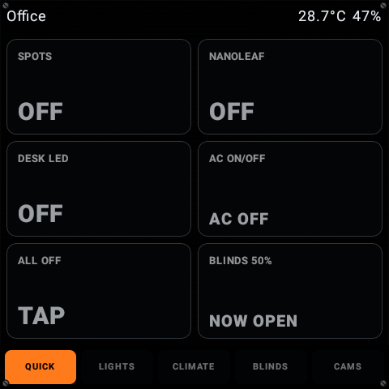
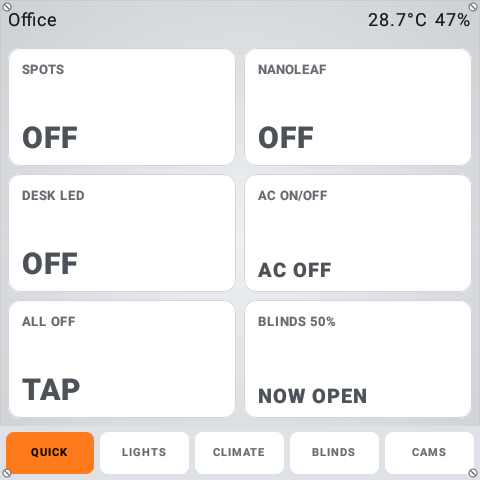

# PanelDash

A small native Home Assistant dashboard for Android wall panels, configured with one YAML file.

PanelDash was built for the Sonoff NSPanel Pro: Android 8.1, a 480 x 480 display, and hardware that deserves something lighter than a permanent browser tab. It renders with Jetpack Compose, streams state from Home Assistant over its WebSocket API, and reloads its layout when the YAML changes.

<p align="center">
  
  
</p>

<p align="center"><sub>Live captures from the panel — the same dashboard in its ambient-light night and day palettes.</sub></p>

## What is included

- Large status tiles designed for a 480 x 480 touch screen.
- Multi-page configs get a persistent bottom navigation bar.
- An optional header for temperature, humidity, window state, or other useful readings.
- YAML elements for stacks, grids, labels, buttons, toggles, progress bars, and spacers.
- Home Assistant service calls, custom service data, and an optimistic state flip after taps.
- Live values from entity states or attributes, including tile sub-lines and progress ranges.
- Per-tile colours, configurable typography, and separate light and dark palettes.
- Automatic theme switching from the panel's ambient light sensor, with sun-time fallback.
- Config hot reload in about two seconds. Layout changes do not need a rebuild or reinstall.
- Full-screen kiosk behaviour with configurable orientation and the screen kept awake.
- Camera tiles that open a full-screen live view, a quiet health page that only lights up when something needs attention, and an optional chime on the panel speaker when the doorbell rings.
- Configurable idle return: after a set period without touches, the panel drifts back to the main page.

No Home Assistant integration or browser is required. PanelDash talks to Home Assistant directly — WebSocket streaming for live state, REST for actions — authenticating with a long-lived access token.

## Current panel

| Item | Current value |
| --- | --- |
| App version | `0.12.0` (`versionCode 17`) |
| Device | Sonoff NSPanel Pro, Android 8.1 |
| ADB endpoint | TCP port 5555 over the LAN |
| Live layout | Based on [`deploy/office.yaml`](deploy/office.yaml) |
| Home Assistant transport | WebSocket streaming (pushes in ~100 ms) |
| Default home app | Yes - boots straight into the dashboard |

The current device was checked over ADB on 22 September 2026. `com.mcsoftware.paneldash/.MainActivity` was the focused activity and was rendering the Office layout shown above.

## Quick start

You need JDK 17 or newer, an Android SDK with platform 36, ADB, and a long-lived Home Assistant token.

Save the token outside the repository. The deploy script will copy it to the panel if this file exists:

```bash
install -m 600 /dev/null ~/paneldash-token.txt
read -rsp "Home Assistant token: " HA_TOKEN
printf '\n'
printf '%s\n' "$HA_TOKEN" > ~/paneldash-token.txt
unset HA_TOKEN
```

Create an ignored local config from the starter, then set its Home Assistant URL and entity IDs:

```bash
cp deploy/config_panel.yaml deploy/my-panel.local.yaml
```

Enable the token file in `deploy/my-panel.local.yaml`. It must appear under `server:`:

```yaml
server:
  url: "http://homeassistant.local:8123"
  token_file: "/sdcard/paneldash/token.txt"
```

Now deploy:

```bash
export ANDROID_HOME="$HOME/android-sdk"
CONFIG=deploy/my-panel.local.yaml ./scripts/deploy.sh
```

The script builds the minified release APK, connects to the panel, installs the app, pushes the token and selected config, then launches PanelDash.

To deploy the Office layout shown above:

```bash
CONFIG=deploy/office.yaml ./scripts/deploy.sh
```

Both device and config can be overridden — inline, or once via an ignored `deploy/local.env`:

```bash
PANEL=192.168.1.100:5555 CONFIG=deploy/my-panel.local.yaml ./scripts/deploy.sh
```

Files matching `deploy/*.local.yaml` and `deploy/local.env` are ignored by Git.

## Edit the dashboard without reinstalling

PanelDash reads the first available config from:

1. `/sdcard/paneldash/config.yaml`
2. `/sdcard/Android/data/com.mcsoftware.paneldash/files/config.yaml`
3. The app's internal copy of the bundled sample

Push a change while the app is running:

```bash
adb -s 192.168.1.100:5555 push deploy/office.yaml /sdcard/paneldash/config.yaml
```

The file watcher picks it up within about two seconds. Config errors, Home Assistant connection failures, and rejected tokens appear in a banner on the panel.

## YAML at a glance

The example below has a shared header and one page containing a two-column control grid.

```yaml
server:
  url: "http://homeassistant.local:8123"
  token_file: "/sdcard/paneldash/token.txt"
  poll_seconds: 5

options:
  orientation: auto
  daynight: sensor
  dark_below_lux: 10
  light_above_lux: 40

theme:
  background: "#000000"
  surface: "#161B21"
  accent: "#FF7A1A"
  text: "#EAF0F6"
  radius: 12

header:
  type: hstack
  padding: 8
  children:
    - type: label
      text: "Home"
      weight: 1
    - type: label
      entity: sensor.living_room_temperature
      format: "{state}°C"

pages:
  - name: "Quick"
    type: vstack
    padding: 8
    children:
      - type: grid
        columns: 2
        spacing: 8
        weight: 1
        children:
          - type: toggle
            text: "Lights"
            entity: light.living_room
            action: toggle
            color: "#FFA43C"
          - type: button
            text: "All off"
            entity: scene.all_off
            action: activate
            highlight: false
```

See the [full YAML reference](docs/yaml-format.md) for every element, action, theme option, state placeholder, and service-data example.

## Build and install manually

Build the smaller release APK. It is roughly 1 MB after R8 minification, which makes installs much more reliable over the panel's patchy Wi-Fi.

```bash
export ANDROID_HOME="$HOME/android-sdk"
./gradlew :app:assembleRelease

adb connect 192.168.1.100:5555
adb -s 192.168.1.100:5555 push app/build/outputs/apk/release/app-release.apk /data/local/tmp/paneldash.apk
adb -s 192.168.1.100:5555 shell pm install -r /data/local/tmp/paneldash.apk
adb -s 192.168.1.100:5555 shell am start -n com.mcsoftware.paneldash/.MainActivity
```

The release build currently uses the debug signing key so it can be installed directly on the development panel. It is not a Play Store distribution build.

For a local debug APK:

```bash
./gradlew :app:assembleDebug
# app/build/outputs/apk/debug/app-debug.apk
```

## Project map

```text
app/src/main/java/com/mcsoftware/paneldash/
  Config.kt        YAML model and parser
  HaClient.kt      Home Assistant REST client (services + fallback)
  HaStream.kt      WebSocket streaming client
  Dashboard.kt     State store, streaming merge, tap handling
  Render.kt        Compose renderer
  DayNight.kt      Ambient-light and sun-time theme selection
  Presence.kt      Proximity sensor (wake on approach)
  Overlays.kt      Doorbell alert, camera peek, chime playback
  MainActivity.kt  Kiosk setup, config watcher, and app lifecycle

app/src/main/assets/default_config.yaml  Bundled fallback config
app/src/main/assets/chime.wav            Doorbell chime (generated by scripts/make_chime.py)
deploy/config_panel.yaml                 Starter panel config
deploy/office.yaml                       Example live config (adapt entity IDs to yours)
docs/yaml-format.md                      Complete YAML reference
docs/paneldash-live.png                  Live device screenshot (night)
docs/paneldash-day.png                   Live device screenshot (day)
docs/prototypes/                         Earlier visual explorations
scripts/deploy.sh                        Build, install, configure, and launch
scripts/make_chime.py                    Regenerate the bundled chime
.github/workflows/build.yml              CI: builds the release APK on push/PR
```

## Network and token safety

The default setup uses cleartext HTTP to Home Assistant and exposes ADB over TCP. Keep both on a trusted LAN or VPN. Do not expose port 5555 to the internet, and never commit a Home Assistant token. `token_file` keeps the secret out of Git, but `/sdcard/paneldash/token.txt` is shared external storage on Android 8.1, not app-private storage. This setup assumes a dedicated panel on a trusted network.

## Possible next steps

- Optional scrolling for panels with taller or narrower displays.
- More input controls, such as sliders and selectable presets.
- Generic alert system (smoke/CO, power loss) reusing the doorbell overlay.
- Power and EV pages (energy rates, vehicle charge state).

## License

Released under the [MIT License](LICENSE). PanelDash is an independent project, not affiliated with ITEAD / Sonoff or with Home Assistant.
